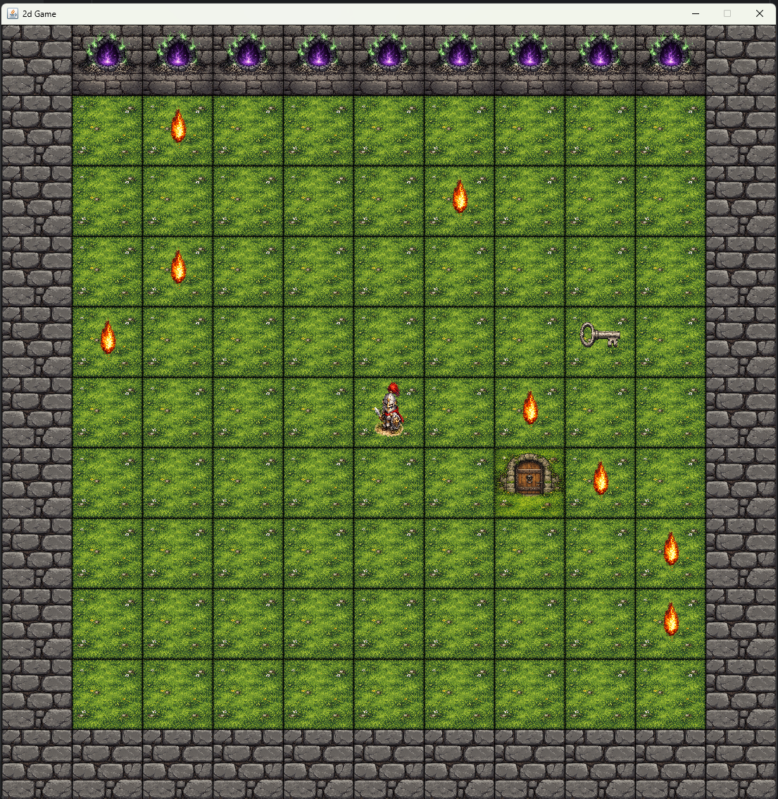

# 2D Game With GUI

A simple 2D tile-based game built with **Java Swing**. This project demonstrates clean architecture principles,
separation of concerns, and sprite-based rendering in a desktop Java application.

## Features

- Tile-based board system
- Player movement with keyboard controls
- Enemy spawning and downward movement
- Collision detection with walls
- Layered rendering (background → entities → effects)
- Transparent PNG sprite support
- Basic game engine structure

## Architecture

The project follows a layered architecture approach:

StartUp → GameEngine (logic) → GamePanel (rendering) → GameFrame (window container)

### Project Structure

core/

- GameEngine
- Board
- BoardFactory

models/

- Cell
- Player
- Enemy

view/

- GamePanel
- GameFrame

input/

- InputHandler

### Responsibilities

- **GameEngine** handles movement, collisions, and game state
- **Board** stores the tile grid and map data
- **GamePanel** renders the current engine state
- **GameFrame** represents the main application window
- **InputHandler** processes keyboard input

## Assets

Sprites are stored in `resources/textures/` and include grass and wall textures, an undead portal, flame effects, a
burning knight sprite, and transparent entity sprites.

## Controls

- W / ↑ Move Up
- S / ↓ Move Down
- A / ← Move Left
- D / → Move Right

## How to Run

1. Clone the repository
2. Open it in IntelliJ IDEA
3. Mark the `resources` folder as **Resources Root**
4. Run `StartUp.java`

